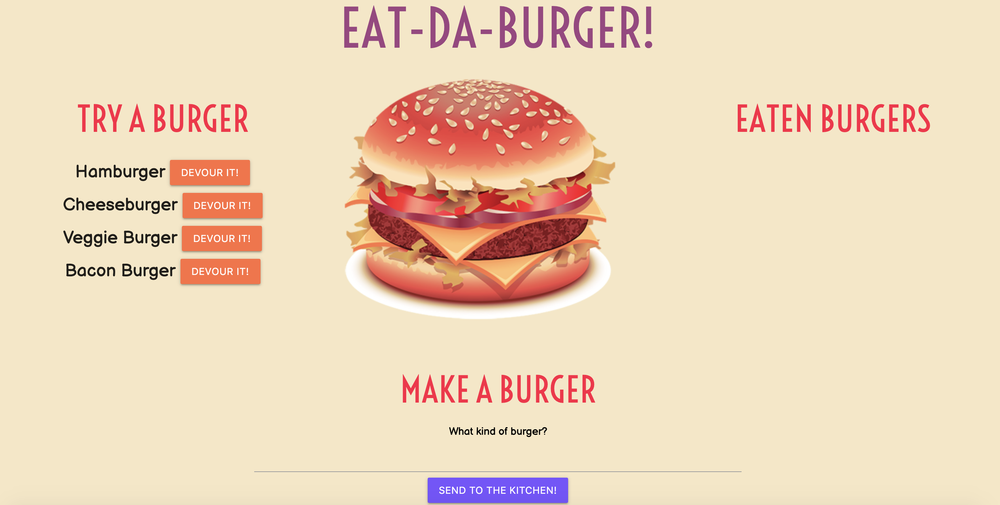
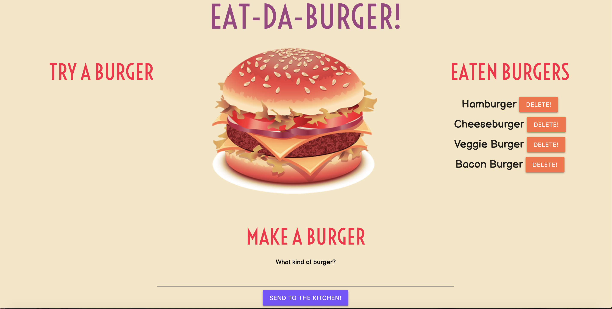
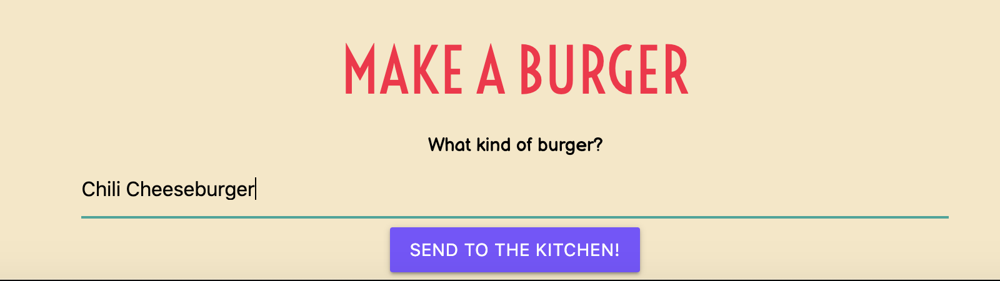
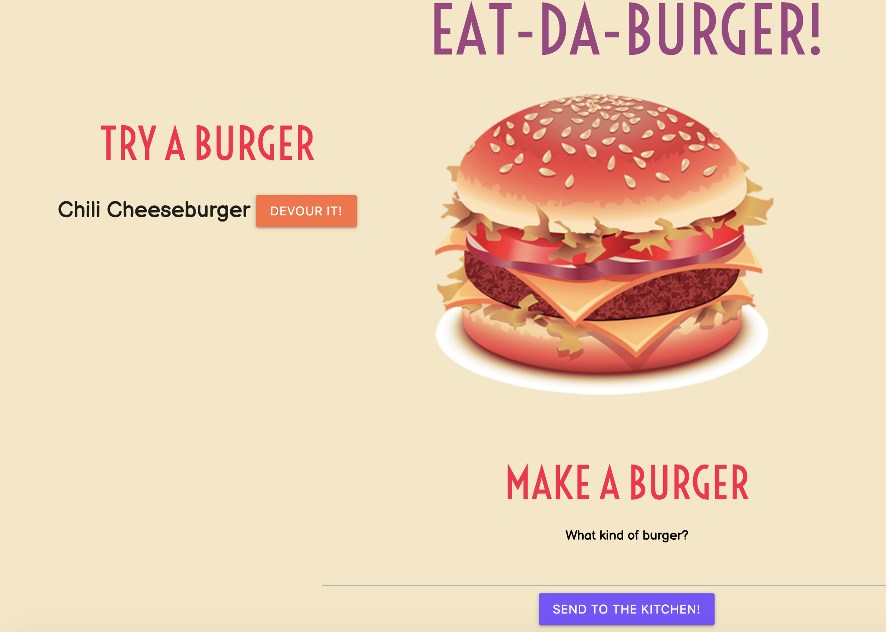

# Eat-Da-Burger Application

> Missing your favorite burger joint? Well, now you can simulate the experience with "Eat-Da-Burger", a restautant app that utilizes MySQL, Node.js, Express, and Handlebars to provide an app where users can add burgers, virtually "devour them" and even delete them.

## Table of Contents

 * [Description](#description)
 * [Usage](#usage)
  * [Screenshots](#screenshots)
  * [License](#license)
  * [Questions](#questions)

## Description

  Eat-Da-Burger is a virtual restaurant application where users can "eat" burgers with the click of a button, input burgers they want to see through a form, and even delete burgers they don't want to see off their list of previously eaten burgers. This application uses a database created with MySQL to store the burger data, and JavaScript, Node.js, Express.js, and Express Handlebars to connect the database to the application. Materialize CSS and Google Fonts are also used in the application layout.

  You can visit the application at https://eat-da-burger-mw-app.herokuapp.com/.

## Usage

Users can virtually eat burgers on the left-hand side of the application by clicking "DEVOUR IT!", which is on a button next to every burger in the list. Once they have done that, the burger will be moved to the Eaten Burgers column on the right-hand side. If a user wants, they can also delete the burger from the column with the "DELETE!" button. In addition, users can make their own burgers by typing the name of the burger into the "Make a Burger" form, and clicking the "Send to the kitchen!" button. Their newly created burger will then be added to the "Try a Burger" column, and they are free to devour it.

## Screenshots

A column of burgers before the "Devour It!" button is clicked

When the "Devour It!" button is clicked, the burgers are moved to the right-hand side

The process of adding a burger to the page

When the Submit button on the form is clicked, the burger is displayed to the page!

## License

Copyright 2020 Maria Waslick

Permission is hereby granted, free of charge, to any person obtaining a copy of this software and associated documentation files (the "Software"), to deal in the Software without restriction, including without limitation the rights to use, copy, modify, merge, publish, distribute, sublicense, and/or sell copies of the Software, and to permit persons to whom the Software is furnished to do so, subject to the following conditions:

The above copyright notice and this permission notice shall be included in all copies or substantial portions of the Software.

THE SOFTWARE IS PROVIDED "AS IS", WITHOUT WARRANTY OF ANY KIND, EXPRESS OR IMPLIED, INCLUDING BUT NOT LIMITED TO THE WARRANTIES OF MERCHANTABILITY, FITNESS FOR A PARTICULAR PURPOSE AND NONINFRINGEMENT. IN NO EVENT SHALL THE AUTHORS OR COPYRIGHT HOLDERS BE LIABLE FOR ANY CLAIM, DAMAGES OR OTHER LIABILITY, WHETHER IN AN ACTION OF CONTRACT, TORT OR OTHERWISE, ARISING FROM, OUT OF OR IN CONNECTION WITH THE SOFTWARE OR THE USE OR OTHER DEALINGS IN THE SOFTWARE.

## Questions

If you have additional questions, you can contact me through my GitHub profile at [mwaslick](https://github.com/mwaslick), or e-mail me at mariawaslick@gmail.com.
